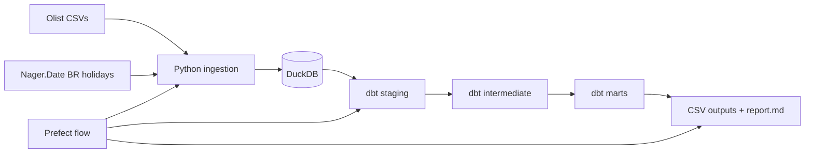

# 🚀 Lance Data Olist Analytics Stack

Local, production-shaped analytics stack for the Lance Data Forward Deployed Data Engineer technical test. It ingests the Olist Brazilian e-commerce CSVs plus Brazilian public holidays, loads DuckDB, transforms with dbt, orchestrates with Prefect, and exports analysis for the required business questions.

## 🌟 Quick start

1. Install dependencies:

```bash
uv sync --group dev
```

2. Download the Olist dataset into `data/raw`:

```bash
uv run kaggle datasets download -d olistbr/brazilian-ecommerce -p data/raw --unzip
```

3. Run the full local pipeline:

```bash
uv run python scripts/flow.py
```

Or run through Docker Compose:

```bash
docker compose up --build pipeline
```

## 🧱 What the pipeline does



The main orchestration entrypoint is `scripts/flow.py`:

1. `scripts/ingest.py` loads raw Olist CSVs and Brazilian public holidays into `data/warehouse/olist.duckdb`.
2. `dbt run --profiles-dir .` builds staging, intermediate, and mart models.
3. `dbt test --profiles-dir .` validates key non-null and uniqueness assumptions.
4. `scripts/export_analysis.py` exports result CSVs and refreshes `report.md`.

## 💡 Project structure

| Path | Purpose |
|---|---|
| `scripts/ingest.py` | Idempotent raw ingestion into DuckDB. |
| `scripts/flow.py` | Prefect orchestration for the whole pipeline. |
| `scripts/export_analysis.py` | Business-question SQL exports and report generation. |
| `models/staging` | Light type cleanup and source normalization. |
| `models/intermediate` | Business-grain order, item, and customer sequence facts. |
| `models/marts` | Final analytical marts for the five questions. |
| `docs/architecture.md` | Mermaid architecture diagram. |
| `docs/erd.md` | Mermaid ERD. |
| `docs/demo_script.md` | Interview/demo walkthrough. |
| `docs/change_requests.md` | Likely interview change requests and responses. |
| `summary.md` | Short project summary and architecture. |
| `report.md` | Detailed presentation reference with result tables. |
| `progress.md` | Implementation progress log. |
| `output/*.csv` | Generated analysis outputs. |

## 🌍 Business questions answered

1. Revenue and seasonality: monthly GMV by product category, YoY growth, anomaly months, and holiday context.
2. Customer cohort and repeat behaviour: first-purchase cohorts, second purchase within 90 days, by customer state.
3. Delivery performance vs review score: on-time delivery, same-state/cross-state shipments, category segmentation, and investigation recommendation.
4. Proposed question: payment method mix and installment behaviour.
5. Proposed question: customer value by Brazilian state.

See `report.md` for the detailed answer tables and interpretation.

## 💳 Verification status

The pipeline was run locally on 2026-05-02:

- Raw ingestion: 10 tables loaded.
- dbt run: 18 models built successfully.
- dbt test: 19 tests passed.
- Prefect flow: completed successfully.
- Analysis exports: 7 CSV outputs generated.

## 🔁 Design choices

- **DuckDB**: ideal for a local analytics test, simple file-based deployment, fast enough for the Olist dataset.
- **dbt**: makes SQL transformations reviewable, layered, tested, and easy to explain.
- **Prefect**: lightweight orchestration without running a heavy Airflow/Dagster service.
- **Docker Compose**: proves reproducibility while keeping the stack local.
- **Public holidays enrichment**: directly supports the seasonality question without adding irrelevant complexity.

## 💡 AI disclosure

AI assistance was used to scaffold and implement the project quickly: ingestion code, dbt models, orchestration, documentation, and report generation. The pipeline was executed locally and dbt tests passed. The parts that deserve human review before final submission are the business interpretation wording in `report.md` and whether the simple z-score anomaly method is sufficient for the expected interview depth.

