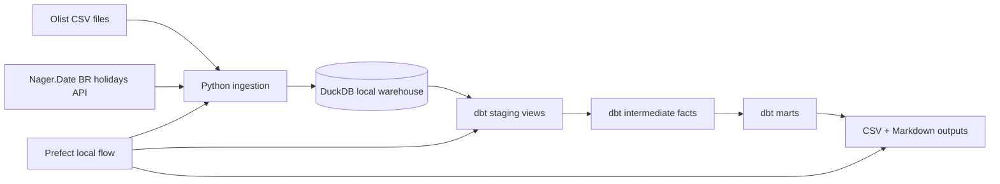

# Architecture

The architecture is intentionally small: one local warehouse file, one dbt project, one orchestrated command. This is enough to demonstrate production habits without creating services that the client team would not need for a local hand-off.
