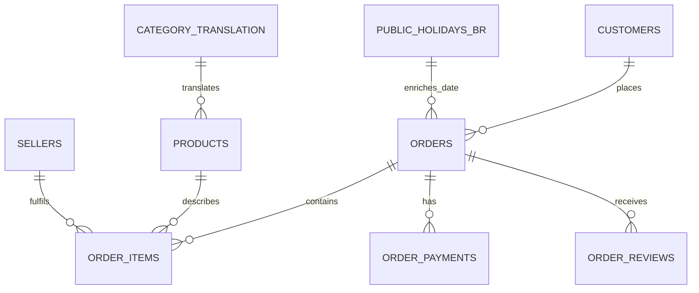

# ERD

The dbt marts are derived from this operational shape but are modeled at analytical grains: monthly category revenue, customer cohorts by state, delivery/review segments, payment mix, and customer value by state.
