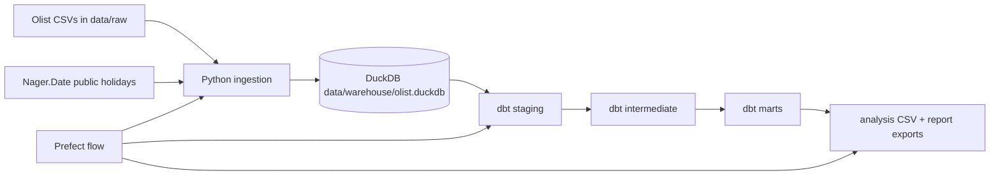
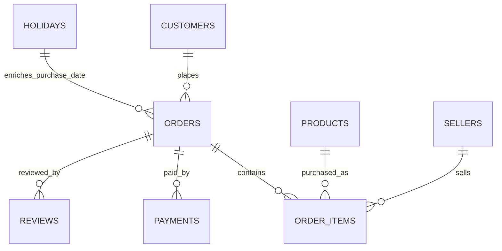

# Lance Data Presentation Report

## Index
1. Executive summary
2. Architecture and run commands
3. Data model
4. Business-question answers
5. Data quality notes
6. Interview defence notes
7. Output inventory

## 1. Executive summary

This project builds a local analytics stack for the Olist Brazilian e-commerce dataset. It ingests raw CSVs plus Brazilian public holidays, loads them into DuckDB, models the warehouse with dbt, orchestrates the full run with Prefect, and exports CSV/Markdown outputs for client-facing analysis.

Key analytical stance: keep the stack small enough to defend live, but shaped like production: raw/staging/intermediate/marts, idempotent ingestion, dbt tests, one orchestration entrypoint, documented assumptions, and reproducible Docker Compose execution.

## 2. Architecture and run commands



Primary command:

```bash
uv run python scripts/flow.py
```

Docker command:

```bash
docker compose up --build pipeline
```

## 3. Data model

Raw source tables are loaded into DuckDB schema `raw`. dbt builds:

- `main_staging`: light type normalization and column cleanup.
- `main_intermediate`: business-grain facts for delivered orders, items, and customer order sequence.
- `main_marts`: query-ready tables for revenue, cohorts, delivery/reviews, payment mix, and customer value.



## 4. Business-question answers

### Q1. Revenue and seasonality

Monthly GMV by category is exported in `output/q1_top_monthly_category_gmv.csv`. YoY growth is calculated when a prior-year month exists for the same category. Anomalies use a simple z-score by category, which is easy to explain and enough for a technical test.

Top monthly category GMV rows:

| order_month | product_category | orders | gmv | yoy_growth_pct | anomaly_z_score | is_anomaly_month | holiday_gmv_share_pct |
| --- | --- | --- | --- | --- | --- | --- | --- |
| 2018-05-01 00:00:00 | watches_gifts | 585 | 119528.88 | 225.81 | 1.89 | False | 9.58 |
| 2018-08-01 00:00:00 | health_beauty | 765 | 119391.01 | 140.1 | 1.78 | False | 0.0 |
| 2018-06-01 00:00:00 | health_beauty | 790 | 106745.72 | 235.08 | 1.42 | False | 0.0 |
| 2018-07-01 00:00:00 | health_beauty | 699 | 103647.21 | 200.35 | 1.34 | False | 2.07 |
| 2018-02-01 00:00:00 | computers_accessories | 791 | 102672.14 | 807.07 | 2.31 | True | 5.18 |
| 2018-03-01 00:00:00 | watches_gifts | 407 | 95688.05 | 284.41 | 1.19 | False | 1.93 |
| 2017-11-01 00:00:00 | watches_gifts | 424 | 95292.34 | nan | 1.18 | False | 5.32 |
| 2018-07-01 00:00:00 | watches_gifts | 507 | 95219.79 | 182.53 | 1.17 | False | 2.7 |
| 2018-05-01 00:00:00 | health_beauty | 669 | 94534.38 | 101.61 | 1.08 | False | 7.83 |
| 2018-04-01 00:00:00 | health_beauty | 619 | 91058.45 | 310.61 | 0.98 | False | 7.37 |
| 2018-04-01 00:00:00 | watches_gifts | 462 | 89223.06 | 281.6 | 1.0 | False | 4.7 |
| 2017-11-01 00:00:00 | bed_bath_table | 804 | 88951.75 | nan | 1.63 | False | 4.45 |
| 2018-01-01 00:00:00 | sports_leisure | 575 | 86406.83 | 794.63 | 1.78 | False | 0.44 |
| 2018-02-01 00:00:00 | health_beauty | 595 | 85493.2 | 287.55 | 0.82 | False | 6.28 |
| 2018-06-01 00:00:00 | watches_gifts | 444 | 85027.57 | 211.03 | 0.87 | False | 0.0 |

Anomaly months:

| order_month | product_category | gmv | anomaly_z_score | holiday_gmv_share_pct | holiday_day_orders |
| --- | --- | --- | --- | --- | --- |
| 2018-08-01 00:00:00 | food | 8174.18 | 3.86 | 0.0 | 0 |
| 2017-04-01 00:00:00 | dvds_blu_ray | 1434.9 | 3.53 | 1.04 | 1 |
| 2017-09-01 00:00:00 | fixed_telephony | 13692.91 | 3.4 | 0.0 | 0 |
| 2017-03-01 00:00:00 | home_comfort_2 | 342.88 | 3.39 | 0.0 | 0 |
| 2018-07-01 00:00:00 | costruction_tools_tools | 5501.2 | 3.34 | 4.23 | 1 |
| 2017-05-01 00:00:00 | art | 6927.25 | 3.33 | 0.0 | 0 |
| 2018-03-01 00:00:00 | audio | 10606.69 | 3.3 | 4.71 | 1 |
| 2017-04-01 00:00:00 | market_place | 4045.28 | 3.22 | 0.0 | 0 |
| 2018-01-01 00:00:00 | stationery | 39522.72 | 3.19 | 0.12 | 1 |
| 2018-06-01 00:00:00 | signaling_and_security | 5863.18 | 3.17 | 0.0 | 0 |
| 2018-01-01 00:00:00 | luggage_accessories | 18546.32 | 3.13 | 1.5 | 1 |
| 2018-04-01 00:00:00 | home_appliances | 16246.23 | 3.08 | 1.51 | 4 |
| 2017-11-01 00:00:00 | agro_industry_and_commerce | 13932.49 | 2.99 | 0.0 | 0 |
| 2018-04-01 00:00:00 | drinks | 5016.44 | 2.97 | 0.86 | 1 |
| 2018-05-01 00:00:00 | cine_photo | 2108.29 | 2.97 | 3.93 | 1 |

Holiday interpretation: public holidays are useful context, but they do not automatically explain category-level spikes. The exported `holiday_gmv_share_pct` shows whether revenue was concentrated on actual holiday dates. For most anomalies, the safer recommendation is to investigate promotions, marketplace campaigns, and supply/category events before attributing causality to holidays.

### Q2. Customer cohort and repeat behaviour

Repeat behavior is measured as customers who place a second delivered order within 90 days of their first delivered purchase, grouped by first-purchase month and customer state.

Best repeat states with meaningful volume:

| customer_state | customers | repeat_customers_90d | repeat_rate_90d_pct |
| --- | --- | --- | --- |
| ES | 1927.0 | 32.0 | 1.66 |
| MT | 855.0 | 13.0 | 1.52 |
| SP | 39145.0 | 504.0 | 1.29 |
| RJ | 11913.0 | 151.0 | 1.27 |
| GO | 1894.0 | 24.0 | 1.27 |
| BA | 3158.0 | 39.0 | 1.23 |
| PB | 504.0 | 6.0 | 1.19 |
| MG | 10998.0 | 122.0 | 1.11 |
| RS | 5167.0 | 57.0 | 1.1 |
| DF | 2018.0 | 21.0 | 1.04 |
| MS | 681.0 | 7.0 | 1.03 |
| PE | 1548.0 | 15.0 | 0.97 |
| PR | 4768.0 | 45.0 | 0.94 |
| SC | 3444.0 | 31.0 | 0.9 |
| CE | 1257.0 | 10.0 | 0.8 |

Recent cohort/state rows:

| cohort_month | customer_state | customers | repeat_customers_90d | repeat_rate_90d_pct |
| --- | --- | --- | --- | --- |
| 2018-08-01 00:00:00 | SP | 3059 | 12.0 | 0.39 |
| 2018-08-01 00:00:00 | RJ | 694 | 3.0 | 0.43 |
| 2018-08-01 00:00:00 | MG | 682 | 2.0 | 0.29 |
| 2018-08-01 00:00:00 | PR | 313 | 3.0 | 0.96 |
| 2018-08-01 00:00:00 | RS | 279 | 2.0 | 0.72 |
| 2018-08-01 00:00:00 | SC | 192 | 0.0 | 0.0 |
| 2018-08-01 00:00:00 | BA | 157 | 0.0 | 0.0 |
| 2018-08-01 00:00:00 | DF | 141 | 0.0 | 0.0 |
| 2018-08-01 00:00:00 | GO | 113 | 0.0 | 0.0 |
| 2018-08-01 00:00:00 | ES | 100 | 0.0 | 0.0 |
| 2018-08-01 00:00:00 | PE | 81 | 0.0 | 0.0 |
| 2018-08-01 00:00:00 | CE | 54 | 0.0 | 0.0 |
| 2018-08-01 00:00:00 | PA | 42 | 0.0 | 0.0 |
| 2018-08-01 00:00:00 | MT | 39 | 0.0 | 0.0 |
| 2018-08-01 00:00:00 | MS | 35 | 0.0 | 0.0 |

Interpretation: repeat rates in this dataset are generally low, which fits a marketplace with many one-off purchases. The best client action is to separate acquisition-heavy states from retention opportunities, then inspect category mix and delivery experience for states with relatively higher repeat behavior.

### Q3. Delivery performance vs review score

The mart segments reviews by on-time status, same-state versus cross-state shipment, and product category.

Lowest-scoring high-volume segments:

| product_category | shipment_scope | delivery_status | orders | avg_review_score | avg_days_late | low_review_share_pct |
| --- | --- | --- | --- | --- | --- | --- |
| stationery | cross_state | late_or_unknown | 126 | 2.14 | 11.66 | 67.13 |
| toys | cross_state | late_or_unknown | 202 | 2.16 | 10.07 | 64.79 |
| baby | cross_state | late_or_unknown | 183 | 2.3 | 10.49 | 60.22 |
| sports_leisure | cross_state | late_or_unknown | 425 | 2.32 | 10.23 | 60.57 |
| bed_bath_table | cross_state | late_or_unknown | 595 | 2.35 | 9.81 | 60.61 |
| health_beauty | cross_state | late_or_unknown | 553 | 2.35 | 9.54 | 59.9 |
| cool_stuff | cross_state | late_or_unknown | 181 | 2.35 | 11.33 | 60.32 |
| watches_gifts | cross_state | late_or_unknown | 344 | 2.37 | 8.97 | 58.73 |
| computers_accessories | cross_state | late_or_unknown | 393 | 2.39 | 9.44 | 58.32 |
| auto | cross_state | late_or_unknown | 219 | 2.4 | 11.54 | 57.83 |
| perfumery | cross_state | late_or_unknown | 171 | 2.4 | 9.9 | 59.78 |
| furniture_decor | cross_state | late_or_unknown | 385 | 2.44 | 9.63 | 57.92 |
| garden_tools | cross_state | late_or_unknown | 225 | 2.5 | 8.59 | 58.55 |
| watches_gifts | same_state | late_or_unknown | 114 | 2.51 | 6.62 | 53.91 |
| telephony | cross_state | late_or_unknown | 258 | 2.53 | 8.31 | 53.45 |

Recommendation: prioritize late/cross-state segments with both high order volume and low review score. Those segments are more actionable than tiny categories with extreme averages. Investigate seller dispatch latency, carrier routes, and expectation-setting on estimated delivery dates.

### Q4. Proposed stakeholder question: How does payment method mix affect cash and customer experience?

Payment mix:

| payment_type | orders | payment_value | avg_installments |
| --- | --- | --- | --- |
| credit_card | 74304.0 | 12101094.88 | 3.49 |
| boleto | 19191.0 | 2769932.58 | 1.0 |
| voucher | 3679.0 | 343013.19 | 1.0 |
| debit_card | 1485.0 | 208421.12 | 1.0 |

Reason for asking: finance and product teams care about payment method adoption, installment behavior, and operational exposure. This is a practical stakeholder question because Brazil has strong installment-card behavior.

### Q5. Proposed stakeholder question: Which states have the strongest customer value?

State-level customer value:

| customer_state | customers | avg_customer_gmv | median_customer_gmv | total_gmv | repeat_customer_share_pct |
| --- | --- | --- | --- | --- | --- |
| PB | 504 | 224.04 | 119.15 | 112916.71 | 2.38 |
| PA | 922 | 189.23 | 109.93 | 174470.59 | 2.39 |
| MT | 855 | 178.02 | 99.99 | 152203.82 | 3.39 |
| CE | 1257 | 174.78 | 99.9 | 219698.38 | 1.59 |
| MS | 681 | 169.53 | 98.99 | 115451.97 | 2.64 |
| MA | 698 | 167.0 | 99.4 | 116569.38 | 1.86 |
| PE | 1548 | 162.66 | 99.9 | 251803.78 | 2.33 |
| BA | 3158 | 156.38 | 98.0 | 493847.55 | 2.85 |
| GO | 1894 | 149.52 | 97.85 | 283184.6 | 3.12 |
| RJ | 11913 | 147.69 | 95.28 | 1759399.43 | 3.27 |
| SC | 3444 | 147.02 | 89.99 | 506341.62 | 2.67 |
| DF | 2018 | 146.96 | 89.9 | 296563.01 | 2.97 |
| MG | 10998 | 141.18 | 89.99 | 1552670.17 | 2.95 |
| RS | 5167 | 141.07 | 89.9 | 728925.47 | 3.06 |
| PR | 4768 | 139.77 | 87.74 | 666427.32 | 2.96 |

Reason for asking: commercial teams need to know where customer value is concentrated, not just where order counts are highest. This helps prioritize regional campaigns and seller acquisition.

## 5. Data quality notes

- Analysis is restricted to delivered orders for operational comparability.
- GMV uses item price, excluding freight unless explicitly shown.
- Review scores are averaged at order/item segment level; review text is not modeled.
- Product categories use English translation where available and fall back to Portuguese or `unknown`.
- Public holiday enrichment comes from Nager.Date, with a static fallback for resilience.
- Same-state/cross-state uses customer state vs seller state, not physical route distance.

## 6. Interview defence notes

- DuckDB is appropriate because the dataset is small-to-medium, local, and analytical.
- dbt enforces a defensible modeling contract and makes SQL reviewable.
- Prefect is used as a lightweight local orchestrator, not as an overbuilt server deployment.
- Docker Compose proves reproducibility without pretending this needs cloud infrastructure.
- The model deliberately avoids ML, streaming, and dashboard overbuild because the rubric rewards explainability.

Common change request responses:

- Add a new enrichment: create one ingestion function, one raw table, one staging model, then join in marts.
- Add a dashboard: consume `main_marts` tables or exported CSVs; do not query raw tables directly.
- Scale beyond local: replace DuckDB with Postgres/BigQuery/Snowflake and keep dbt layers mostly intact.

## 7. Output inventory

Generated CSV outputs:

- `output/q1_top_monthly_category_gmv.csv`
- `output/q1_anomaly_months.csv`
- `output/q2_best_repeat_states.csv`
- `output/q2_recent_cohorts.csv`
- `output/q3_delivery_review_segments.csv`
- `output/q4_payment_mix.csv`
- `output/q5_customer_ltv_state.csv`

