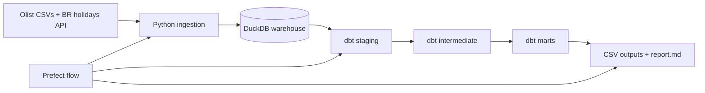

# Lance Data Project Summary

## One-line summary

A local Olist marketplace analytics stack using Python ingestion, DuckDB, dbt, Prefect, and Docker Compose, with generated business-question outputs and a presentation-ready report.

## Architecture

## Core files

| File/path | Purpose |
|---|---|
| `scripts/flow.py` | Main orchestration entrypoint. |
| `scripts/ingest.py` | Loads Olist CSVs and Brazilian public holidays into DuckDB. |
| `models/` | dbt staging, intermediate, and marts. |
| `scripts/export_analysis.py` | Exports the analytical answers to `output/` and `report.md`. |
| `report.md` | Detailed reference for presentation/interview. |
| `docs/demo_script.md` | Live demo walkthrough. |

## Current verification

- Ingestion completed: 10 raw tables.
- dbt completed: 18 models built.
- dbt tests completed: 19 passed.
- Prefect flow completed successfully.
- Generated 7 analytical CSV outputs.

## Main analytical outputs

- `output/q1_top_monthly_category_gmv.csv`
- `output/q1_anomaly_months.csv`
- `output/q2_best_repeat_states.csv`
- `output/q2_recent_cohorts.csv`
- `output/q3_delivery_review_segments.csv`
- `output/q4_payment_mix.csv`
- `output/q5_customer_ltv_state.csv`

## Presentation angle

The winning story is not “I built the biggest stack.” It is: this is a small, reproducible, client-handoff analytics system with clear data layers, documented assumptions, tests, orchestration, and business-facing outputs.
